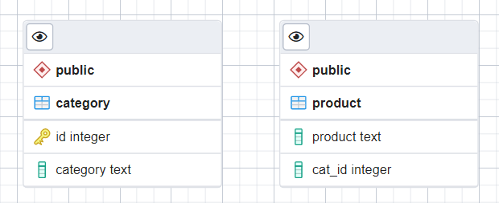
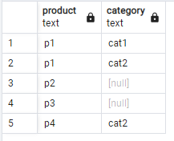
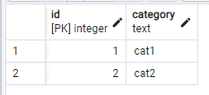
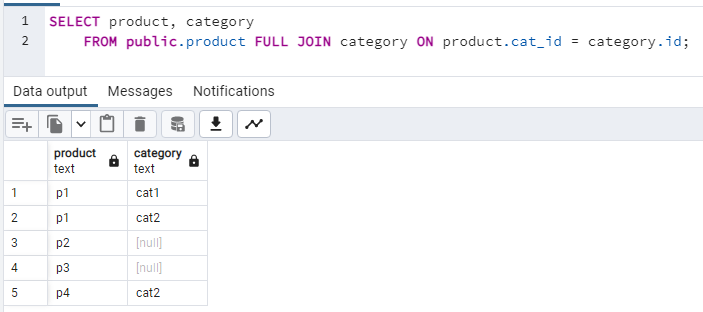

## Тестовое задание на позицию Стажер-разработчик C#
### Библиотека:
Считается, что фигура задается в виде координат (x,y).
Все классы фигур реализуют интерфейс IFigure, 
поэтому можно вычислять её площадь, не зная сам тип.

Так так среди фигур присутствует круг, который по сути не имеет точек, то были сделаны 
интерфейсы  ICircle и IPolygon.

IPolygon является интерфейсом для всех остальных многоугольников и содержит в себе
массивы координат X и Y. 

Для дальнейшего расширения функционала
достаточно будет сделать класс многоугольник и реализовать
вычисление площади по формуле Гаусса.

### База данных:

Таблицы:

Таблица product:

Таблица category:

Запрос:

